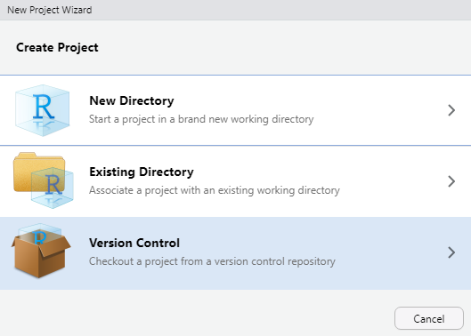

```{r echo = FALSE, message = FALSE}
library(knitr)
opts_knit$set(root.dir = rprojroot::find_rstudio_root_file())
opts_chunk$set(collapse = TRUE, comment = "#>")
opts_chunk$set(warning = TRUE, message = TRUE) 
knit_hooks$set(inline = function(x) {
	if (!is.numeric(x)) { 
		x 
		} else if (x >= 10000) { 
		prettyNum(round(x, 2), big.mark = ",")
		} else {
		prettyNum(round(x, 2))
		}
	})
```


We start by assuming a project administrator has created an RStudio "project" on their local machine and has linked it to a GitHub repository (a "repo"). The repo **author** is ready to invite a **collaborator.** Both author and collaborator should have completed the [Installing software](p001-install-software.md) instructions.

In this approach, the collaborator has the ability and authority to edit the project material without the author's pre-approval. However, because we're using version control, no version is ever lost. We can always revert to an earlier version if needed. 

## Author's initial tasks

- Obtain the collaborator's GitHub name or email address associated with their GitHub account 
- Navigate to the project repo on GitHub (the repo can be public or private)
- Click on the *Settings* icon 
- Click on the *Manage access* tab 
- Click on the *Invite teams or people* button 
- Type the collaborator's GitHub name or email in the dialog box. 

## Collaborator's initial tasks

The collaborator receives and accepts the invitation to collaborate.  

The collaborator "clones" the project as follows. 

- Navigate to the project repo. 
- *Code* pulldown menu and copy the project URL, for example: 


- Keep the URL in your clipboard or save it locally in a temporary text file 
- Launch RStudio
- *File > New Project* and select *Version Control* 




- Select *Git*


- In the dialog box, paste the *Repository URL* you saved earlier 
- The *Project directory name* is auto-filled 
- Use the *Browse* button to select the local directory for storing the project files 
- Click the *Create project* button


***
<a href="#top">&#9650; top of page</a>    
[&#9665; main page](../README.md)
