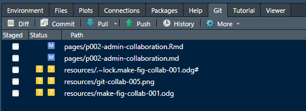
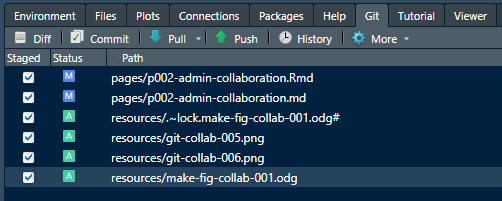
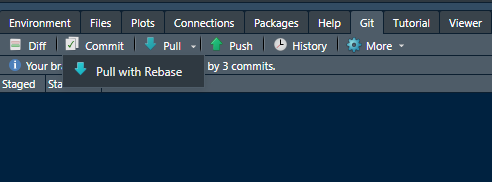

```{r setup, include = FALSE}
library(knitr)
opts_knit$set(root.dir = rprojroot::find_rstudio_root_file())
opts_chunk$set(include = FALSE) 
knit_hooks$set(inline = function(x) {
	if (!is.numeric(x)) { 
		x 
		} else if (x >= 10000) { 
		prettyNum(round(x, 2), big.mark = ",")
		} else {
		prettyNum(round(x, 2))
		}
	})
```


<small>
<br>
<i>Network</i> by gritphilm is licensed under <a href="https://creativecommons.org/licenses/by-nc-nd/2.0/legalcode">CC BY-NC-ND 2.0</a>
<br>
</small>

We start by assuming an **author** has created an RStudio "project" on their local machine and has linked it to a GitHub repository (a "repo"). The author is ready to invite a **co-author** to collaborate. Both author and co-author should have completed the [Installing software](p001-install-software.md) instructions.

In this approach, author and co-authors all have permission to make changes without prior approval by another author. 

If you want to learn more about using git and GitHub, see "Happy Git and GitHub for the useR"  [@Bryan+Hester:2021] from which I adapted most of this tutorial. 


## contents

- [Author's initial tasks] 
- [Co-author's initial tasks] 
- [Synchronizing the work] 
- [Commit] 
- [Pull with rebase] 
- [Push] 


## author's initial tasks

- Obtain the co-author's GitHub name or email address associated with their GitHub account 
- Navigate to the project repo on GitHub (the repo can be public or private)
- Click on the *Settings* icon 
- Click on the *Manage access* tab 
- Click on the *Invite teams or people* button 
- Type the co-author's GitHub name or email in the dialog box. 


## co-author's initial tasks

The co-author receives and accepts the invitation to collaborate.  

The co-author "clones" the project as follows. 

- Navigate to the project repo. 
- *Code* pulldown menu and copy the project URL, for example: 


- Keep the URL in your clipboard or save it locally in a temporary text file 
- Launch RStudio
- *File > New Project* and select *Version Control* 


- Select *Git*


- In the dialog box, paste the *Repository URL* you saved earlier 
- The *Project directory name* is auto-filled 
- Use the *Browse* button to select the local directory for storing the project files 
- Click the *Create project* button


The co-author now has a local repo that matches the main repo on GitHub. 


## synchronizing the work

As the figure illustrates, each worker has their own repository on their local machine and GitHub is used as the single common repository for coordination. Thus the GitHub repo is the main or primary record of the project. 


## commit

Typically, different authors may be working on the project at the same time. To synchronize the work, all authors follow the steps described here.

On your local machine, in RStudio, select the Git tab, for example, 



Check all the boxes in the *Staged* column. 



Click on *Commit*. In the dialog box, type a short description of the changes. Click the *Commit* button. 


Close the commit windows that appear. 

Commit your work often. 


## pull with rebase

When you are ready to synchronize your work, first do a final commit if you have any unstaged changes. 

Next, under the Git tab, use the *Pull* pulldown menu to select *Pull with Rebase*. 



A *Git Pull* window appears. The message will describe changes since the last time you pulled from the GitHub repo. Using pull with rebase, your commits are applied on top of incoming changes.  


## push 

Select *Push* to send your changes to GitHub.  A *Git Push* window appears with a message on the status of the push. You can close the window. 

To confirm that your changes have been correctly pushed, navigate to the GitHub repo. You should find that the remote repository contains your recent edits. 


## references

<div id="refs"></div>


***
<a href="#top">&#9650; top of page</a>    
[&#9665; main page](../README.md)
