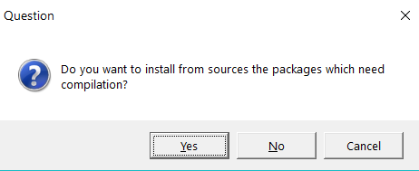

updating the R habitat
================

If you already have R and RStudio installed, please update to the most
recent releases and update your R packages as well.

-   Running old software can be considerably harder than running new
    software.
-   R updates about twice a year.
-   Get current at the start of a new project, but avoid updating if you
    are approaching a project deadline.
-   Read more about it at [Maintaining
    R](https://whattheyforgot.org/maintaining-r.html), a chapter in
    (Bryan and Hester, [2019](#ref-Bryan+Hester:2019)).

## update R

On a Windows machine, we update R using the R GUI running as an
administrator.

-   Navigate to your most recent `Rgui.exe` file located in your
    Programs directory, e.g.,
    `C:\Program Files\R\R-3.5.3\bin\x64\Rgui.exe`  
-   Right-click on `Rgui.exe` and run as administrator

In the R GUI window that appears, run the commands

    if (!require("installr")) {install.packages("installr")}
    library("installr")
    updateR()

OK all defaults with one possible exception.

-   If you have designated a particular directory for your R libraries
    in a `.Renviron file`, for example, I use the `C:/R/library`
    directory, then answer “no” to the library questions in the R
    update.
-   If not, you can answer “yes” to the update the library question.

## update RStudio

Check for updates from the RStudio menu *Help &gt; Check for Updates*.

If *Check for Updates* does not appear in the menu,

-   Find the current version of RStudio from the menu *Help &gt; About
    RStudio*  
-   Navigate to the [RStudio
    website](https://www.rstudio.com/products/rstudio/#Desktop), find
    out what the current version is.

If you decide to update RStudio, close RStudio on your machine, download
the new version, and run the `RStudio-n.n.n.exe` as an administrator
(`n.n.n` is the current version number).

## update R packages

**From within RStudio**

-   From the RStudio pane, Select *Packages &gt; Update*
-   OR, from the menu, *Tools &gt; Check for Package updates …*

When updating packages, if a window pops up asking about compilation,

-   NO saves time
-   YES gets you the latest version but can be time-consuming. Don’t say
    yes if you are in a hurry to get some work done.
