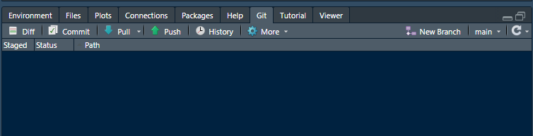

```{r echo = FALSE, message = FALSE}
library(knitr)
opts_knit$set(root.dir = rprojroot::find_rstudio_root_file())
opts_chunk$set(collapse = TRUE, comment = "#>")
opts_chunk$set(warning = TRUE, message = TRUE) 
knit_hooks$set(inline = function(x) {
	if (!is.numeric(x)) { 
		x 
		} else if (x >= 10000) { 
		prettyNum(round(x, 2), big.mark = ",")
		} else {
		prettyNum(round(x, 2))
		}
	})
```


<small>
<br>
<i>Near future</i> by Anja Mexicola is licensed under <a href="https://creativecommons.org/licenses/by-nc/2.0/legalcode">CC BY-NC 2.0</a>
<br>
</small>

We start by assuming an **author** has created an RStudio "project" on their local machine and has linked it to a GitHub repository (a "repo"). The author is ready to share work with an **assistant**. Both author and assistant should have completed the [Installing software](p001-install-software.md) instructions.

In this approach, the assistant's work is submitted to the project as a pull request that requires review by the author (or other project administrator) before acceptance. 

These guidelines are adapted from "Happy Git and GitHub for the useR"  [@Bryan+Hester:2021]. This is the reference to turn to first for help and all the details. 


## contents

Author's tasks 

- [Author's initial tasks] 
- [Author responds to a pull request] 

Assistant's tasks

- [Assistant's initial tasks] 
- [Synchronizing the work] 
- [Branch] 
- [Commit]  
- [Fork pull and push] 
- [Pull request] 
- [Get upstream changes for a fork]


## author's initial tasks

- Make the GitHub repo public  
- Provide the repo URL to the assistant


## author responds to a pull request

Someone submitting a pull request to the project is proposing changes and requesting that someone review and pull in their contribution and merge them into the main branch. Pull requests show differences ("diffs") of the content from both branches.

If a project assistant is working according to the suggested workflow, they performed a fork-and-clone and have edited their copy of the project files using a new branch (not the main branch). They then submit a pull request. 

The author (or any owner/maintainer) reviews the proposed changes and merges  selected changes into the main branch. 

There are a number of approaches to reviewing and accepting pull requests. Please refer to a reference of your choosing to learn the procedure. I suggest: 


- [Reviewing a pull request](https://homes.cs.washington.edu/~mernst/advice/github-pull-request.html#reviewing) by Michael Ernst 
- [Explore and extend a pull request](https://happygitwithr.com/pr-extend.html)  by Jenny Bryan and Jim Hester


## assistant's initial tasks

The assistant "forks" and "clones" the project as follows. 

- Navigate to the project repo using the URL provided by the project admin 
- Click the *Fork* button and select the destination (typically your GitHub account)  
- Navigate to your GitHub account and select the project repo (the fork) saved there 
- *Code* pulldown menu and copy the URL, for example: 


- Keep the URL in your clipboard or save it locally in a temporary text file 
- Launch RStudio
- *File > New Project* and select *Version Control* 


- Select *Git*


- In the dialog box, paste the *Repository URL* you saved earlier 
- The *Project directory name* is auto-filled 
- Use the *Browse* button to select the local directory for storing the project files 
- Click the *Create project* button


The assistant now has a local repo that matches the fork they created. 


## synchronizing the work

As the figure illustrates, the assistant forks and clones the project. The assistant can pull and push to their own remote repo on GitHub but they must initiate a pull request to transmit their proposed changes to the main project repo where it is reviewed before acceptance. 


## branch

**Avoid** making edits to the **main** branch. Because you will be submitting changes to the project directors for review, they will be happier to receive your pull request from a non-main branch. 

Therefore, before beginning any work on your copy of the project, work in a new branch, not the main branch. In RStudio, under the Git tab, click *New branch*. 



In the dialog box, give your branch a short descriptive name, e.g., if I were working on a new function called `new_function`:


The "remote" box should say `origin` to synch with the assistant's remote repo on GitHub. Click *Create.*

Note the change in the Git tab. The branch is now `new_function`. 


Before making any changes, ensure you are working in the new branch. Each pull request should have a unique branch name. 


## commit

Let's assume you have edited the project files on your local machine, working in the new branch. In RStudio, select the Git tab, for example, 


Check all the boxes in the *Staged* column. 


Click on *Commit*. In the dialog box, type a short description of the changes. Click the *Commit* button. 


Close the commit windows that appear. 

Commit your work often.


## fork pull and push

When the assistant is ready to synchronize their work, first do a final commit if there are any unstaged changes.  

Next, pull from the fork (the assistant's primary repo) by

- clicking *Pull* in the Review Changes window, or
- clicking *Pull*  under the Git tab 


A *Git Pull* window appears. The message will describe changes since the last time you pulled from the fork.  

Select *Push* to send your changes to your GitHub repo (not the main project  repo).  A *Git Push* window appears with a message on the status of the push. You can close the window. 

To confirm that your changes have been correctly pushed, navigate to the GitHub fork. You should find that the remote repository contains your recent edits. 


## pull request

Your local repo and your primary repo are now in synch. To submit your proposed edits to the main project team, you initiate a *pull request*. 

Navigate to your remote repo ("origin") on GitHub, e.g., 


- Select the *Pull requests" tab
- Click the green *New pull request* button


## get upstream changes for a fork

If the assistant is planning on continuing to work on the project, they want to be able to update their working copy from the original source files. Assigning the main project repo as an "upstream" remote permits them to pull from the source files to their local machine. 


The first time you do this, in the RStudio Git tab, 

- click *New Branch*
- type `main` for the branch name
- click *Add remote...* 
- type `upstream` for the remote name
- type the URL of the main project for the remote URL
- then *Add* and *Create* 


In subsequent iterations, you do not have to add the remote---it already exists. You should be able to select `main` as the branch name and `upstream` from the remote pulldown menu to update your local project. 

Finally, before doing anything else, switch to the `origin` branch, commit, and push the project to your own remote repo. Now your local repo and your remote repo should be identical to the latest version of the source repo. 


## references

<div id="refs"></div>


***
<a href="#top">&#9650; top of page</a>    
[&#9665; main page](../README.md)
