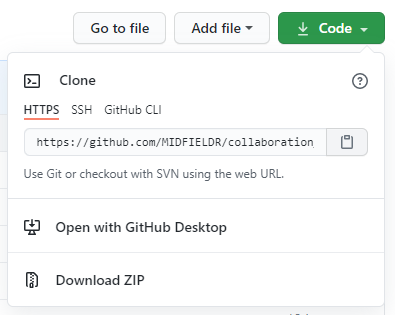
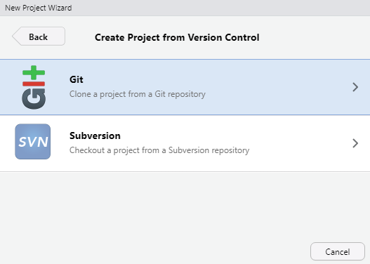
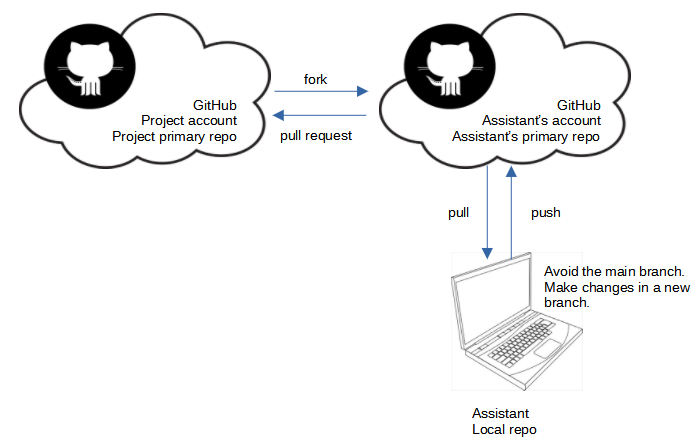
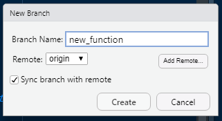
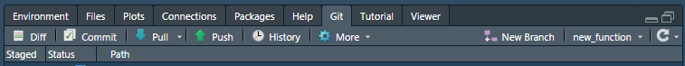

sharing work with assistants
================

 <small>   <i>Near future</i> by
Anja Mexicola is licensed under
<a href="https://creativecommons.org/licenses/by-nc/2.0/legalcode">CC
BY-NC 2.0</a>   </small>

We start by assuming an **author** has created an RStudio “project” on
their local machine and has linked it to a GitHub repository (a “repo”).
The author is ready to share work with an **assistant**. Both author and
assistant should have completed the [Installing
software](p001-install-software.md) instructions.

In this approach, the assistant’s work is submitted to the project as a
pull request that requires review by the author (or other project
administrator) before acceptance.

## contents

-   [Author’s initial tasks](#authors-initial-tasks)
-   [Assistant’s initial tasks](#assistants-initial-tasks)
-   [Synchronizing the work](#synchronizing-the-work)
-   [Branch](#branch)
-   [Commit](#commit)  
-   [Fork pull and push](#fork-pull-and-push)
-   [Pull request](#pull-request)
-   [Get upstream changes for a fork](#get-upstream-changes-for-a-fork)

## author’s initial tasks

-   Make the GitHub repo public  
-   Provide the repo URL to the assistant

## assistant’s initial tasks

The assistant “forks” and “clones” the project as follows.

-   Navigate to the project repo using the URL provided by the project
    admin
-   Click the *Fork* button and select the destination (typically your
    GitHub account)  
-   Navigate to your GitHub account and select the project repo (the
    fork) saved there
-   *Code* pulldown menu and copy the URL, for example:

-   Keep the URL in your clipboard or save it locally in a temporary
    text file
-   Launch RStudio
-   *File &gt; New Project* and select *Version Control*

-   Select *Git*

-   In the dialog box, paste the *Repository URL* you saved earlier
-   The *Project directory name* is auto-filled
-   Use the *Browse* button to select the local directory for storing
    the project files
-   Click the *Create project* button

The assistant now has a local repo that matches the fork they created.

## synchronizing the work

As the figure illustrates, the assistant forks and clones the project.
The assistant can pull and push to their own remote repo on GitHub but
they must initiate a pull request to transmit their proposed changes to
the main project repo where it is reviewed before acceptance.

## branch

**Avoid** making edits to the **main** branch. Because you will be
submitting changes to the project directors for review, they will be
happier to receive your pull request from a non-main branch.
&lt;&lt;&lt;&lt;&lt;&lt;&lt; HEAD

Therefore, before beginning any work on your copy of the project, work
in a new branch, not the main branch. In RStudio, under the Git tab,
click *New branch*.

In the dialog box, give your branch a short descriptive name, e.g., if I
were working on a new function called `new_function()`:

The “remote” box should say `origin` to synch with the assistant’s
remote repo on GitHub. Click *Create.*

Note the change in the Git tab. The branch is now `new_function`.

Before making any changes, ensure you are working in the new branch.

=======

Therefore, before beginning any work on your copy of the project, work
in a new branch, not the main branch. In RStudio, under the Git tab,
click *New branch*.

In the dialog box, give your branch a short descriptive name, e.g., if I
were working on a new function called `new_function()`:

The “remote” box should say `origin` to synch with the assistant’s
remote repo on GitHub. Click *Create.*

Note the change in the Git tab. The branch is now `new_function`.

Before making any changes, ensure you are working in the new branch.
&gt;&gt;&gt;&gt;&gt;&gt;&gt; new\_function

## commit

Let’s assume you have edited the project files on your local machine,
working in the new branch. In RStudio, select the Git tab, for example,

Check all the boxes in the *Staged* column.

Click on *Commit*. In the dialog box, type a short description of the
changes. Click the *Commit* button.

Close the commit windows that appear.

Commit your work often.

## fork pull and push

When the assistant is ready to synchronize their work, first do a final
commit if there are any unstaged changes.

Next, pull from the fork (the assistant’s primary repo) by

-   clicking *Pull* in the Review Changes window, or
-   clicking *Pull* under the Git tab

A *Git Pull* window appears. The message will describe changes since the
last time you pulled from the fork.

Select *Push* to send your changes to your GitHub repo (not the main
project repo). A *Git Push* window appears with a message on the status
of the push. You can close the window.

To confirm that your changes have been correctly pushed, navigate to the
GitHub fork. You should find that the remote repository contains your
recent edits.

## pull request

Your local repo and your primary repo are now in synch. To submit your
proposed edits to the main project team, you initiate a *pull request*.

Navigate to your remote repo (“origin”) on GitHub, e.g.,

-   Select the \*Pull requests" tab
-   Click the green *New pull request* button

## get upstream changes for a fork

If you are planning on continuing to work on the project, you want to be
able to update your working copy from the original source files.

------------------------------------------------------------------------

<a href="#top">▲ top of page</a>  
[◁ main page](../README.md)
