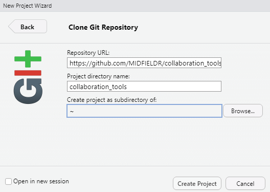

sharing work with assistants
================

We start by assuming an **author** has created an RStudio “project” on
their local machine and has linked it to a GitHub repository (a “repo”).
The author is ready to share wotk with an **assistant**. Both author and
assistant should have completed the [Installing
software](p001-install-software.md) instructions.

In this approach, the assistant’s work is submitted to the project as a
pull request that requires review by a project administrator before
acceptance.

## contents

-   [Author’s initial tasks](#authors-initial-tasks)
-   [Assistant’s initial tasks](#assistants-initial-tasks)
-   [Synchronizing work](#synchronizing-work)

## author’s initial tasks

-   Make the GitHub repo public  
-   Provide the repo URL to the assistant

## assistant’s initial tasks

The assistant “forks” and “clones” the project as follows.

-   Navigate to the project repo using the URL provided by the project
    admin
-   Click the *Fork* button and select the destination (typically your
    GitHub account)  
-   Navigate to your GitHub account and select the project repo (the
    fork) saved there
-   *Code* pulldown menu and copy the URL, for example:

-   Keep the URL in your clipboard or save it locally in a temporary
    text file
-   Launch RStudio
-   *File &gt; New Project* and select *Version Control*

-   Select *Git*

-   In the dialog box, paste the *Repository URL* you saved earlier
-   The *Project directory name* is auto-filled
-   Use the *Browse* button to select the local directory for storing
    the project files
-   Click the *Create project* button

The assistant now has a local repo that matches the fork they created.

## synchronizing work

TBA

------------------------------------------------------------------------

<a href="#top">▲ top of page</a>  
[◁ main page](../README.md)
