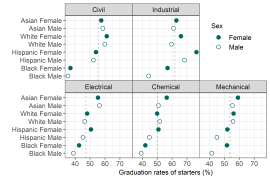
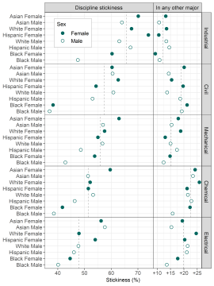

```{r echo = FALSE, message = FALSE}
library(knitr)
opts_knit$set(root.dir = rprojroot::find_rstudio_root_file())
opts_chunk$set(collapse = TRUE, comment = "#>")
opts_chunk$set(warning = FALSE, message = FALSE, echo = FALSE, cache = FALSE) 
knit_hooks$set(inline = function(x) {
	if (!is.numeric(x)) { 
		x 
		} else if (x >= 10000) { 
		prettyNum(round(x, 2), big.mark = ",")
		} else {
		prettyNum(round(x, 2))
		}
	})
```

```{r}
# packages
library(magick)
library(graphclassmate)
library(data.table)
```

```{r}
# page header image
img <- image_read("resources/data-image-2.jpg")
img <- image_scale(img, "791x180!")
image_write(img,
        path = "resources/data-image-2.png",
        format = "png")
```


<small>
<br>
<i>Warm data</i> by beachmobjellies is licensed under <a href="https://creativecommons.org/licenses/by-sa/2.0/legalcode">CC BY-SA 2.0</a>
<br>
</small>

This page provides access to data underlying selected displays published by the MIDFIELD team. The data are in the prepared form used to construct the figures. The figure is shown accompanied by a link to the CSV data file. Figures are organized by the paper in which they appeared. 

To download a data file: 

- Follow the link to see the data in HTML format 
- Right-click on the "Raw" icon > *Save link as ...* to download the file 

## 2019 JEE

Reference [@Lord+Ohland+Layton+Camacho:2019]. All images :copyright: 2019 Journal of Engineering Education. 


Figure 4. CSV data file [(link)](../data/2019-jee-figure-4-data.csv).

```{r echo = FALSE}
# adjust significant digits and edit columns
df <- fread("data-raw/2019-jee-figure-4-data.csv")
df$disc_median <- round(df$disc_median, 1)
setnames(df, old = c("disc", "disc_median"), 
         new = c("discipline", "dspn_median"))
df[, race_ethnicity_sex := paste(race_ethnicity, sex)]
setcolorder(df, c("discipline", "race_ethnicity_sex"))
df[, `:=` (race_ethnicity = NULL, sex = NULL)]
setnames(df, old = c("race_ethnicity_sex"), 
         new = c("race/ethnicity/sex"))
df
fwrite(df, file = "data/2019-jee-figure-4-data.csv")
```

```{r thumb-fig4, echo = FALSE}
# create thumbnails
img <- image_read("figures-raw/fig004-grad-rate.png")
img <- image_scale(img, "10%")
image_write(img,
        path = "figures/thumbnail-fig004-grad-rate.png",
        format = "png")
```




Figure 8. CSV data file [(link)](../data/2019-jee-figure-8-data.csv).

```{r echo = FALSE}
# adjust significant digits 
df <- fread("data-raw/2019-jee-figure-8-data.csv")
cols_to_round<- c("dspn_stick", "dspn_median", "delta_stick", "delta_median")
df[, (cols_to_round) := round(.SD, 1), .SDcols = c(cols_to_round)]
fwrite(df, file = "data/2019-jee-figure-8-data.csv")
```

```{r thumb-fig8, echo = FALSE}
# create thumbnails
img <- image_read("figures-raw/fig008-stickiness.png")
img <- image_scale(img, "10%")
image_write(img,
        path = "figures/thumbnail-fig008-stickiness.png",
        format = "png")
```




## references

<div id="refs"></div>


***
<a href="#top">&#9650; top of page</a>    
[&#9665; main page](../README.md)
