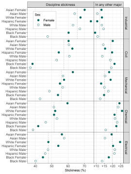

prepared data
================

 <small>   <i>Warm data</i> by
beachmobjellies is licensed under
<a href="https://creativecommons.org/licenses/by-sa/2.0/legalcode">CC
BY-SA 2.0</a>   </small>

This page provides access to data underlying selected displays published
by the MIDFIELD team. The data are in the prepared form used to
construct the figures. The figure is shown accompanied by a link to the
CSV data file. Figures are organized by the paper in which they
appeared.

To download a data file:

-   Follow the link to view the data in HTML format
-   Right-click on the “Raw” icon &gt; *Save link as …* to download the
    file

## 2019 JEE

Reference ([1](#ref-Lord+Ohland+Layton+Camacho:2019)). All images &#169;
2019 Journal of Engineering Education.

**Figure 4**

-   Graduation rates of starters in a discipline grouped by
    race/ethnicity and sex
-   data file [(link)](../data/2019-jee-figure-4-data.csv)

**Figure 8**

-   Stickiness of a discipline (left column) and the associated increase
    in stickiness (right column) for students ever in that discipline
    who graduate in any other major
-   data [(link)](../data/2019-jee-figure-8-data.csv)

**Figure 10**

-   Contour plot of migration yield as the product of the fraction of
    migrators attracted to a discipline (horizontal scale) and the
    fraction of those students graduating in the discipline (vertical
    scale).
-   data (link) placeholder
-   image thumbnail

## 2011 JEE

Reference ([2](#ref-Ohland+Brawner+Camacho+others:2011)). All images
&#169; 2011 Journal of Engineering Education.

**Figure 1**

-   caption placeholder
-   data (link) placeholder
-   image thumbnail

**Figure 2**

-   caption placeholder
-   data (link) placeholder
-   -image thumbnail

**Figure 3**

-   caption placeholder
-   data (link) placeholder
-   image thumbnail

## references

1. Lord SM, Ohland MW, Layton RA, Camacho MM.
2019. Beyond pipeline and pathways: Ecosystem
metrics. *Journal of Engineering Education*. 108(1):32–56

2. Ohland MW, Brawner CE, Camacho MM, Layton RA,
Long RA, et al. 2011. Race, gender, and measures of
success in engineering education. *Journal of Engineering
Education*. 100(2):225–52

------------------------------------------------------------------------

<a href="#top">▲ top of page</a>  
[◁ main page](../README.md)
