```{r setup, include = FALSE}
library(knitr)
opts_knit$set(root.dir = rprojroot::find_rstudio_root_file())
opts_chunk$set(include = FALSE) 
knit_hooks$set(inline = function(x) {
	if (!is.numeric(x)) { 
		x 
		} else if (x >= 10000) { 
		prettyNum(round(x, 2), big.mark = ",")
		} else {
		prettyNum(round(x, 2))
		}
	})
```

```{r packages}
# packages
library("magick")
library("graphclassmate")
library("r2symbols")
library("wrapr")
library("data.table")
library(ggplot2)

# page header image
# img <- image_read("resources/p005-header.jpg")
# img <- image_scale(img, "791x180!")
# image_write(img,
#         path = "resources/p005-header.png",
#         format = "png")

thumb_size <- "300x"
```


<small>
<br>
<i>Warm data</i> by beachmobjellies is licensed under <a href="https://creativecommons.org/licenses/by-sa/2.0/legalcode">CC BY-SA 2.0</a>
<br>
</small>

This page provides access to data underlying selected displays published by the MIDFIELD team. The data are in the prepared form used to construct the figures. The figure is shown accompanied by a link to the CSV data file. Figures are organized by the paper in which they appeared. 

To download a data file: 

- Follow the link to view the data in HTML format 
- Right-click on the "Raw" icon > *Save link as ...* to download the file 


## 2019 JEE

*Beyond pipeline and pathways: Ecosystem metrics*  [@Lord+Ohland+Layton+Camacho:2019]    
<small>Images `r sym("copyright")` 2019 Journal of Engineering Education</small> 

**Figure 4**

```{r 2019-jee-fig-04}
# data carpentry
df <- fread("data-raw/2019-jee/2019-jee-figure-4-data.csv")
df$disc_median <- round(df$disc_median, 1)
setnames(df, old = c("disc", "disc_median"), 
         new = c("discipline", "dspn_median"))
df[, race_ethnicity_sex := paste(race_ethnicity, sex)]
setcolorder(df, c("discipline", "race_ethnicity_sex"))
df[, `:=` (race_ethnicity = NULL, sex = NULL)]
fwrite(df, file = "data/2019-jee-figure-4-data.csv")

# create thumbnail
# img <- image_read("figures-raw/fig004-grad-rate.png")
# img <- image_scale(img, thumb_size)
# image_write(img,
#         path = "figures/thumb-2019-jee-fig-04.png",
#         format = "png")
```

- Graduation rates of starters in a discipline grouped by race/ethnicity and sex 
- data file [(link)](../data/2019-jee-figure-4-data.csv) 

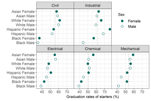

**Figure 8**

```{r 2019-jee-fig-08}
# data carpentry
df <- fread("data-raw/2019-jee/2019-jee-figure-8-data.csv")
cols_to_round<- c("dspn_stick", "dspn_median", "delta_stick", "delta_median")
df[, (cols_to_round) := round(.SD, 1), .SDcols = c(cols_to_round)]
setnames(df, old = c("race/ethnicity/sex"), 
         new = c("race_ethnicity_sex"))
fwrite(df, file = "data/2019-jee-figure-8-data.csv")

# create thumbnail
# img <- image_read("figures-raw/fig008-stickiness.png")
# img <- image_scale(img, thumb_size)
# image_write(img,
#         path = "figures/thumb-2019-jee-fig-08.png",
#         format = "png")
```

- Stickiness of a discipline (left column) and the associated increase in stickiness (right column) for students ever in that discipline who graduate in any other major 
- data [(link)](../data/2019-jee-figure-8-data.csv) 

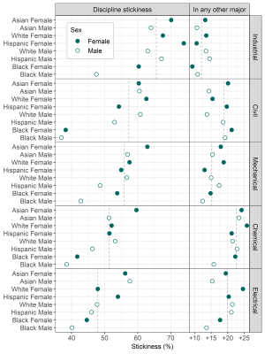

**Figure 10**

```{r 2019-jee-fig-10}


# create thumbnail
# img <- image_read("figures-raw/2019-jee-fig-10.png")
# img <- image_scale(img, thumb_size)
# image_write(img,
#         path = "figures/thumb-2019-jee-fig-10.png",
#         format = "png")
```

- Contour plot of migration yield as the product of the fraction of migrators attracted to a discipline (horizontal scale) and the fraction of those students graduating in the discipline (vertical scale).
- data (link) placeholder


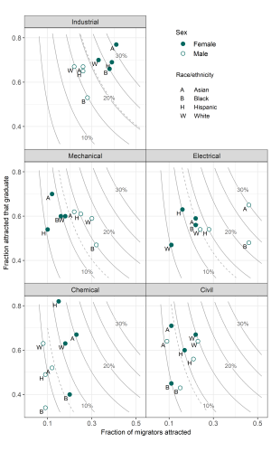


## 2011 JEE 

*Race, gender, and measures of success in engineering education* [@Ohland+Brawner+Camacho+others:2011]    
<small>Images `r sym("copyright")` 2011 Journal of Engineering Education</small> 

**Figure 1**

```{r 2011-jee-fig-01}
# data carpentry
df <- fread("data-raw/2011-jee/Grad6Sem8FMRawData.csv", 
            select = c("fSem8", "fGrd6", "mSem8", "mGrd6"))
df[, institution := 1:nrow(df)]
df

fem <- df[, .(institution, fSem8, fGrd6 )]
fem[, sex := "Female"]
setnames(fem, 
         old = c("fSem8", "fGrd6"), 
         new = c("persist_8", "grad_6"))
mel <- df[, .(institution, mSem8, mGrd6 )]
mel[, sex := "Male"]
setnames(mel, 
         old = c("mSem8", "mGrd6"), 
         new = c("persist_8", "grad_6"))
df <- rbindlist(list(fem, mel))
setcolorder(df, c("institution", "sex"))
setkeyv(df, c("institution", "sex"))
fwrite(df, file = "data/2011-jee-figure-1-data.csv")

# ggplot(df, aes(x = persist_8, y = grad_6, color = sex)) +
#   geom_smooth(method = "lm", se = FALSE) + 
#   geom_point() +
#   scale_x_log10(limits = c(100, 10000)) +
#   scale_y_log10(limits = c(100, 10000))

# create thumbnail
# img <- image_read("figures-raw/2011-jee-fig-01.png")
# img <- image_scale(img, thumb_size)
# image_write(img,
#         path = "figures/thumb-2011-jee-fig-01.png",
#         format = "png")
```

- The number of men (open circles) and women (filled circles) at a particular institution who matriculate in engineering and persist to the eighth semester (horizontal position) and the number of those students who subsequently graduate in engineering within six years (vertical position). 
- data file [(link)](../data/2011-jee-figure-1-data.csv) 

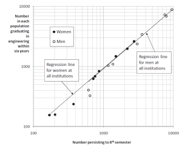

**Figure 2**

```{r 2011-jee-fig-02}
# data carpentry
df <- fread("data-raw/2011-jee/fig02AllSym.csv", 
            skip = 1, select = 1:6)
df[, institution := base::letters[c(1:8,11)]]
df

# columns 1 and 5 are women
# columns 2 and 6 are men
setnames(df, old = c("V1", "V2", "V5", "V6"), 
         new = c("f_persist_8", 
                 "m_persist_8", 
                 "f_pct_yield", 
                 "m_pct_yield"))
df[, c("V3", "V4") := NULL]
df

fem <- df[, .(institution, f_persist_8 , f_pct_yield )]
fem[, sex := "Female"]
setnames(fem, 
         old = c("f_persist_8", "f_pct_yield"), 
         new = c("persist_8", "pct_yield"))
mel <- df[, .(institution, m_persist_8 , m_pct_yield )]
mel[, sex := "Male"]
setnames(mel, 
         old = c("m_persist_8", "m_pct_yield"), 
         new = c("persist_8", "pct_yield"))
df2 <- rbindlist(list(fem, mel))
setcolorder(df2, c("institution", "sex"))
setkeyv(df2, c("institution", "sex"))
df2
fwrite(df2, file = "data/2011-jee-figure-2p1-data.csv")


ggplot(df) +
  geom_point(aes(x = f_persist_8, y = f_pct_yield), 
             shape = 16) +
  geom_point(aes(x = m_persist_8, y = m_pct_yield), 
             shape = 1) +
  geom_text(aes(x = f_persist_8, 
                y = f_pct_yield, 
                label = institution, 
                hjust = -1)) +
  scale_x_continuous(limits = c(0.4, 0.8)) +
  scale_y_continuous(limits = c(0.4, 1.0)) +
  geom_segment(aes(x = f_persist_8, y = f_pct_yield, 
                   xend = m_persist_8, yend = m_pct_yield)) +
  theme(aspect.ratio = 1)

# create thumbnail
# img <- image_read("figures-raw/2011-jee-fig-02.png")
# img <- image_scale(img, thumb_size)
# image_write(img,
#         path = "figures/thumb-2011-jee-fig-02.png",
#         format = "png")
```

- Eight-semester persistence, yield, and six-year graduation rate of various populations. Each panel compares institutions by gender. All races/ethnicities are aggregated in the main panel (Figure 2.1) and disaggregated in the smaller panels (Figures 2.2 through 2.6).
- data file 2.1 [(link)](../data/2011-jee-figure-2p1-data.csv) 

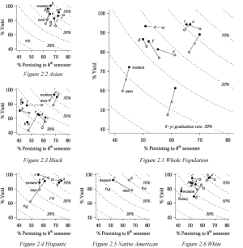

**Figure 3**

```{r 2011-jee-fig-03}
# data carpentry
# TBD

# create thumbnail
# img <- image_read("figures-raw/2011-jee-fig-03.png")
# img <- image_scale(img, thumb_size)
# image_write(img,
#         path = "figures/thumb-2011-jee-fig-03.png",
#         format = "png")
```

- Six-year graduation rates disaggregated by institution and gender. Individual panels compare behaviors by race/ethnicity.
- data (link) placeholder

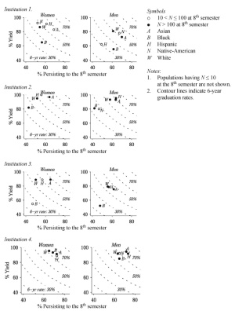


## 2009 JWMSE 

*Who’s persisting in engineering? A comparative analysis of female and male Asian, Black, Hispanic, Native American, and White students* [@Lord+Camacho+Layton+others:2009]    
<small>Images `r sym("copyright")` 2009 Journal of Women and Minorities in Science and Engineering</small>

**Figure 2**

```{r 2009-jwmse-fig-02}
# data carpentry
# TBD

# create thumbnail
# img <- image_read("figures-raw/2009-jwmse-fig-02.png")
# img <- image_scale(img, thumb_size)
# image_write(img,
#         path = "figures/thumb-2009-jwmse-fig-02.png",
#         format = "png")
```

- Comparison by gender of the eighth-semester destinations of Engineering matriculants.
- data (link) placeholder


**Figure 4**

```{r 2009-jwmse-fig-04}
# data carpentry
# TBD

# create thumbnail
# img <- image_read("figures-raw/2009-jwmse-fig-04.png")
# img <- image_scale(img, thumb_size)
# image_write(img,
#         path = "figures/thumb-2009-jwmse-fig-04.png",
#         format = "png")
```

- Percentages of Engineering matriculants persisting to the eighth-semester in Engineering.
- data (link) placeholder

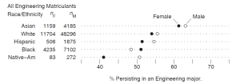

**Figure 5**

```{r 2009-jwmse-fig-05}
# data carpentry
# TBD

# create thumbnail
# img <- image_read("figures-raw/2009-jwmse-fig-05.png")
# img <- image_scale(img, thumb_size)
# image_write(img,
#         path = "figures/thumb-2009-jwmse-fig-05.png",
#         format = "png")
```

- Comparison by gender (with all races aggregated) of the distribution of fourth-semester GPAs in STEM courses 
- data (link) placeholder

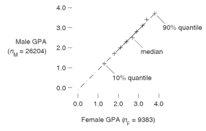


## 2008 JEE 

*Persistence, engagement, and migration in engineering programs* [@Ohland+Sheppard+Lichtenstein+others:2008]    
<small>Images `r sym("copyright")` 2008 Journal of Engineering Education</small> 

**Figure 1**

```{r 2008-jee-fig-01}
# data carpentry
# TBD

# create thumbnail
# img <- image_read("figures-raw/2008-jee-fig-01.png")
# img <- image_scale(img, thumb_size)
# image_write(img,
#         path = "figures/thumb-2008-jee-fig-01.png",
#         format = "png")
```

- MIDFIELD persistence chart: Outcomes at eight semesters for students matriculating in various major groups, 1987--1999
- data (link) placeholder

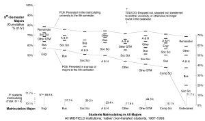

**Figure 2**

```{r 2008-jee-fig-02}
# data carpentry
# TBD

# create thumbnail
# img <- image_read("figures-raw/2008-jee-fig-02.png")
# img <- image_scale(img, thumb_size)
# image_write(img,
#         path = "figures/thumb-2008-jee-fig-02.png",
#         format = "png")
```

- MIDFIELD migration chart: The matriculation major of students in various major groups in the eighth semester
- data (link) placeholder

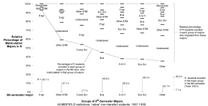

**Figure 3**

```{r 2008-jee-fig-03}
# data carpentry
# TBD

# create thumbnail
# img <- image_read("figures-raw/2008-jee-fig-03.png")
# img <- image_scale(img, thumb_size)
# image_write(img,
#         path = "figures/thumb-2008-jee-fig-03.png",
#         format = "png")
```

- MIDFIELD persistence chart for institutional comparison, all institutions, 1987--1999
- data (link) placeholder

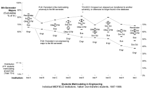

**Table 10**

```{r 2008-jee-table-10}
# reconstruct data from table in paper
df <- build_frame(
  "letter_grade", "Arts_Hum", "Bus", "Comp_Sci", "Engr", "Other", "Other_STM", "Soc_Sci" | 
    "A", 40, 31, 33, 35, 36, 38, 38 |
    "B", 30, 32, 29, 31, 30, 30, 29 |
    "C", 16, 21, 19, 19, 19, 17, 17 |
    "D",  4,  6,  6,  6,  5,  5,  5 |
    "F",  6,  6,  7,  5,  6,  6,  6 |
    "W",  4,  4,  5,  4,  4,  4,  4 
)

df <- data.table(df)
df <- melt(df, 
           id = "letter_grade", 
           measure = c("Arts_Hum", "Bus", "Comp_Sci", "Engr", "Other", "Other_STM", "Soc_Sci"), 
           variable.name = "group_of_majors", 
           value.name = "percent_of_major")
df <- df[, .(group_of_majors, letter_grade, percent_of_major)]
df

fwrite(df, file = "data/2008-jee-table-10-data.csv")

# create thumbnail
# img <- image_read("figures-raw/2008-jee-table-10.png")
# img <- image_scale(img, thumb_size)
# image_write(img,
#         path = "figures/thumb-2008-jee-table-10.png",
#         format = "png")
```

- Cumulative frequency of transcript-recorded grades in MIDFIELD data
- data file [(link)](../data/2008-jee-table-10-data.csv) 

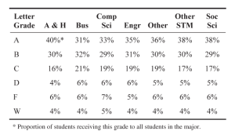


 


## references

<div id="refs"></div>


***
<a href="#top">&#9650; top of page</a>    
[&#9665; main page](../README.md)
