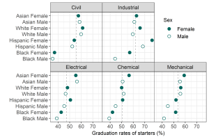
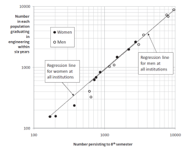
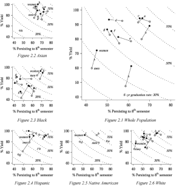
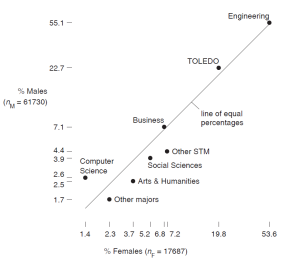
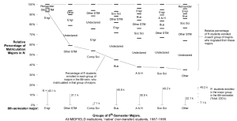

prepared data
================

 <small>   <i>Warm data</i> by
beachmobjellies is licensed under
<a href="https://creativecommons.org/licenses/by-sa/2.0/legalcode">CC
BY-SA 2.0</a>   </small>

This page provides access to data underlying selected displays published
by the MIDFIELD team. The data are in the prepared form used to
construct the figures. The figure is shown accompanied by a link to the
CSV data file. Figures are organized by the paper in which they
appeared.

To download a data file:

-   Follow the link to view the data in HTML format
-   Right-click on the “Raw” icon > *Save link as …* to download the
    file

## 2019 JEE

*Beyond pipeline and pathways: Ecosystem metrics*
\[[1](#ref-Lord+Ohland+Layton+Camacho:2019)\]  
<small>Images copyright 2019 Journal of Engineering Education</small>

**Figure 4**

-   Graduation rates of starters in a discipline grouped by
    race/ethnicity and sex
-   data file [(link)](../data/2019-jee-figure-4-data.csv)

**Figure 8**

-   Stickiness of a discipline (left column) and the associated increase
    in stickiness (right column) for students ever in that discipline
    who graduate in any other major
-   data [(link)](../data/2019-jee-figure-8-data.csv)

**Figure 10**

-   Contour plot of migration yield as the product of the fraction of
    migrators attracted to a discipline (horizontal scale) and the
    fraction of those students graduating in the discipline (vertical
    scale).
-   data (link) placeholder

## 2011 JEE

*Race, gender, and measures of success in engineering education*
\[[2](#ref-Ohland+Brawner+Camacho+others:2011)\]  
<small>Images copyright 2011 Journal of Engineering Education</small>

**Figure 1**

-   The number of men (open circles) and women (filled circles) at a
    particular institution who matriculate in engineering and persist to
    the eighth semester (horizontal position) and the number of those
    students who subsequently graduate in engineering within six years
    (vertical position).
-   data file [(link)](../data/2011-jee-figure-1-data.csv)

**Figure 2**

-   Eight-semester persistence, yield, and six-year graduation rate of
    various populations. Each panel compares institutions by gender. All
    races/ethnicities are aggregated in the main panel (Figure 2.1) and
    disaggregated in the smaller panels (Figures 2.2 through 2.6).
-   data file 2.1 [(link)](../data/2011-jee-figure-2p1-data.csv)

**Figure 3**

-   Six-year graduation rates disaggregated by institution and gender.
    Individual panels compare behaviors by race/ethnicity.
-   data (link) placeholder

## 2009 JWMSE

*Who’s persisting in engineering? A comparative analysis of female and
male Asian, Black, Hispanic, Native American, and White students*
\[[3](#ref-Lord+Camacho+Layton+others:2009)\]  
<small>Images copyright 2009 Journal of Women and Minorities in Science
and Engineering</small>

**Figure 2**

-   Comparison by gender of the eighth-semester destinations of
    Engineering matriculants.
-   data file [(link)](../data/2009-jwmse-fig-02-data.csv)

**Figure 4**

-   Percentages of Engineering matriculants persisting to the
    eighth-semester in Engineering.
-   data (link) placeholder

**Figure 5**

-   Comparison by gender (with all races aggregated) of the distribution
    of fourth-semester GPAs in STEM courses
-   data (link) placeholder

## 2008 JEE

*Persistence, engagement, and migration in engineering programs*
\[[4](#ref-Ohland+Sheppard+Lichtenstein+others:2008)\]  
<small>Images copyright 2008 Journal of Engineering Education</small>

**Figure 1**

-   MIDFIELD persistence chart: Outcomes at eight semesters for students
    matriculating in various major groups, 1987–1999
-   data (link) placeholder

**Figure 2**

-   MIDFIELD migration chart: The matriculation major of students in
    various major groups in the eighth semester
-   data (link) placeholder

**Figure 3**

-   MIDFIELD persistence chart for institutional comparison, all
    institutions, 1987–1999
-   data (link) placeholder

**Table 10**

-   Cumulative frequency of transcript-recorded grades in MIDFIELD data
-   data file [(link)](../data/2008-jee-table-10-data.csv)

## references

1\. Lord SM, Ohland MW, Layton RA, Camacho MM (2019) Beyond pipeline and pathways: Ecosystem metrics.
*Journal of Engineering Education*, 108(1):32–56.
https://doi.org/<https://doi.org/10.1002/jee.20250>

2\. Ohland MW, Brawner CE, Camacho MM, Layton RA, Long RA, Lord SM,
Wasburn MH (2011) Race, gender, and measures of
success in engineering education. *Journal of Engineering
Education*, 100(2):225–252.
https://doi.org/<https://doi.org/10.1002/j.2168-9830.2011.tb00012.x>

3\. Lord SM, Camacho MM, Layton RA, Ohland RALMW, Wasburn MH (2009)
Who’s persisting in engineering? A comparative
analysis of female and male Asian, Black, Hispanic, Native American, and
White students. *Journal of Women and Minorities in Science and
Engineering*, 15:167–190.

4\. Ohland MW, Sheppard SD, Lichtenstein G, Eris O, Chachra D, Layton RA
(2008) Persistence, engagement, and migration in
engineering programs. *Journal of Engineering Education*,
97(3):259–278.
https://doi.org/<https://doi.org/10.1002/j.2168-9830.2008.tb00978.x>

------------------------------------------------------------------------

<a href="#top">▲ top of page</a>  
[◁ main page](../README.md)
